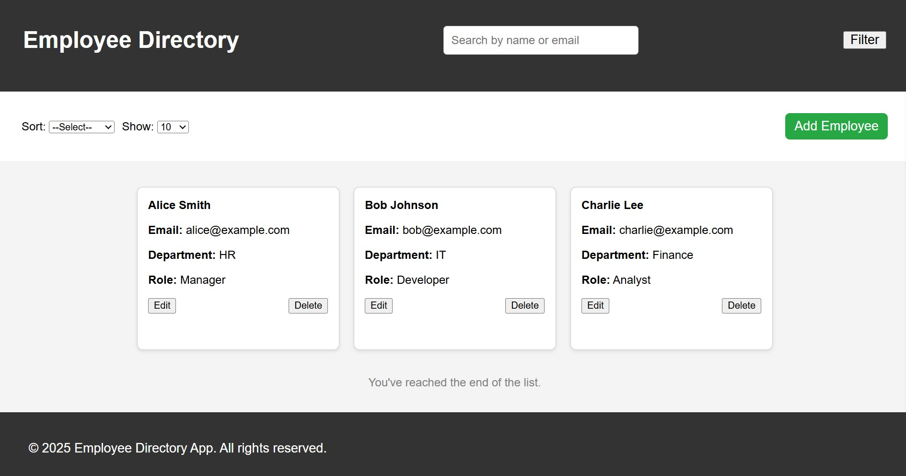
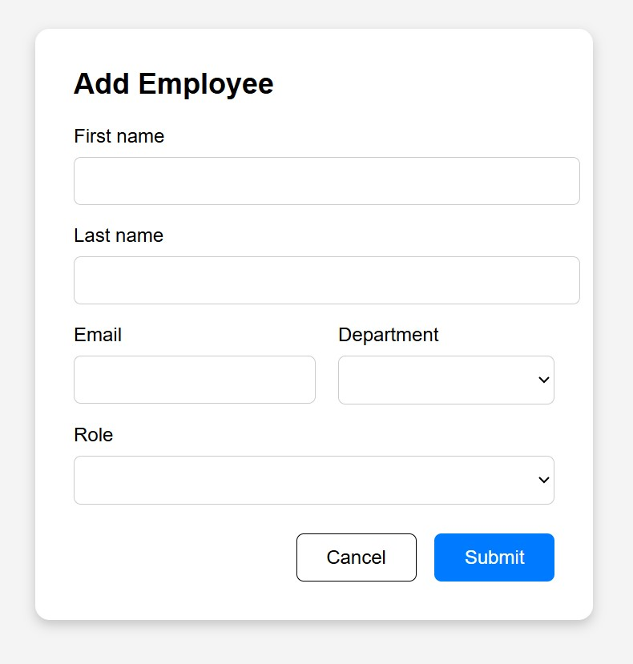

# Employee Directory Web Interface

A responsive and interactive Employee Directory built using **HTML**, **CSS**, **Vanilla JavaScript**, and **Freemarker templating** (optional for dynamic rendering). This application allows users to view, add, edit, delete, filter, sort, and search employee details — all stored locally in the browser via `localStorage`.

---

## 🔧 Setup & Run Instructions

1. **Clone this repository**:
   ```bash
   git clone https://github.com/nandhinigurumoorthyy/Employee-Directory.git
   cd Employee-Directory
    ````

2. **Run the project**:

   * Open `index.html` in any modern web browser (Chrome, Firefox, Edge).
   * No backend or server setup is required.
   * All data is handled locally using `localStorage`.

---

## 📁 Project Structure

```plaintext
employee-directory/
├── index.html               # Main dashboard (list and grid view)
├── form.html                # Add/Edit employee form (modal or page)
├── form.ftl            
├── styles/
│   └── main.css             # Responsive styling (desktop, tablet, mobile)
├── scripts/
│   ├── app.js               # Handles grid rendering, filters, search, sort
│   └── form-handler.js      # Handles form submission, validation
├── data/
│   └── employees.json       # Mock data 
├── assets/                 
│    └── logo.jpg
│    └── dashboard.jpg     
│    └── form.jpg
└── README.md                # You're reading it now
```

---

## 💻 Screenshots


| Dashboard View                       | Add/Edit Modal             |
| ------------------------------------ | -------------------------- |
|  |  |

---

## 🌐 Responsive Design

The UI is fully responsive and works across:

* ✅ **Desktop**
* ✅ **Tablet**
* ✅ **Mobile**

Responsive CSS (`@media` queries) ensures layout and interactivity scale properly on all screen sizes.

---

## ✨ Features

* ✅ View employee cards or table
* ✅ Add/Edit employees (popup modal or new page)
* ✅ Delete with confirmation
* ✅ Search by name or email
* ✅ Filter by First Name, Department, Role
* ✅ Sort by First Name or Department
* ✅ Choose items per page (10, 25, 50, 100)
* ✅ Persistent storage using `localStorage`
* ✅ "No results found" and "End of list" handling

---

## 💡 Reflection

### ✅ What Was Accomplished:

- **Designed a responsive, single-page Employee Directory UI** using only HTML, CSS, and Vanilla JavaScript.
- **Simulated a local data layer** using `localStorage` to persist employee records without backend support.
- **Integrated dynamic filtering, sorting, and searching** across multiple employee fields (name, email, department, role).
- **Implemented Add/Edit/Delete workflows** with intuitive modals and client-side form validation.
- **Ensured responsive design compatibility** across desktop, tablet, and mobile views.
- **Maintained clean, modular code structure** separating styles, logic, and templates.

### ⚠️ Challenges faced:

* Managing state (filter + sort + scroll) without a framework.
* Making select filters and role/department inputs work during Edit.


### 🚀 If Given More Time

* **Add user authentication** – Restrict access to editing or deleting employees with login.
* **Drag & Drop sorting** – Allow drag-and-drop to reorder employee cards visually.
* **Analytics Dashboard** – Show charts for department distribution or role breakdown.
* **Dark Mode** – Add a toggle for light/dark theme preference.
* **Form Autosave** – Save form progress in `localStorage` in case of accidental refresh.
* **Undo Delete** – Add a short-term undo for accidental deletions.
* **Custom avatars** – Let users upload employee profile images or use initials.

---

## 📜 License

This project is for educational/demo purposes and doesn't use any server or third-party APIs.

---
